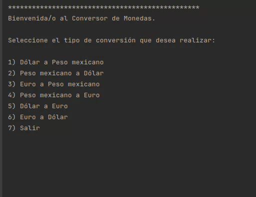

# Conversor de Monedas 💱


---

## 📑 Índice

- [Descripción del proyecto](#descripción-del-proyecto)
- [Estado del proyecto](#estado-del-proyecto)
- [Demostración de funcionalidades](#demostración-de-funcionalidades)
- [Cómo usar el proyecto](#cómo-usar-el-proyecto)
- [Tecnologías utilizadas](#tecnologías-utilizadas)
- [Contacto](#contacto)
- [Autores](#autores)
- [Licencia](#licencia)

---

## 📝 Descripción del proyecto

Este proyecto es un conversor de monedas en consola que permite realizar conversiones entre **dólares**, **pesos mexicanos** y **euros**. El usuario puede seleccionar cualquier combinación entre estas tres monedas, ingresar una cantidad, y ver el resultado equivalente. Todo esto se ejecuta en un bucle hasta que el usuario decide salir.

Este proyecto fue desarrollado como parte de un **challenge de un Bootcamp de Programación Back-End** de **Oracle + Alura Latam**.

---

## 📌 Estado del proyecto

✅ Proyecto terminado (en su versión Back-End)  
🚫 No se contempla una interfaz gráfica (Front-End)

---

## 🎥 Demostración de funcionalidades

Los usuarios pueden:

- Convertir entre dólares, euros y pesos mexicanos en cualquier dirección.
- Ver los resultados de forma clara en la terminal.
- Utilizar el programa cuantas veces deseen hasta salir.



---

## ⚙️ Cómo usar el proyecto

1. Dirígete a la sección **Releases** del repositorio.
2. Descarga el archivo `.jar` desde la sección de Releases del repositorio: [Haz clic aquí para ir a la última versión](https://github.com/JenniferButanda/ConversorDeMonedas/releases/tag/v1.0.0)
3. Guarda el archivo en una carpeta de tu preferencia.
4. Abre una terminal y navega a esa carpeta o abre directamente la carpeta con la opción "Abrir en la Terminal"/"Open in Terminal".
5. Ejecuta el programa con la siguiente línea de código:
  ```bash
java -jar ConversorDeMonedas.jar
```

## ⚠️ Es necesario tener instalada la versión Java 17 o superior.
---

## 🛠️ Tecnologías utilizadas

- Lenguaje: **Java 17.0.15**
- IDE: **IntelliJ IDEA**
- Librería externa: **Gson** (para manejo de datos en formato JSON)

---

## 📬 Contacto

Si tienes dudas, comentarios o sugerencias, puedes escribirme a:  
📧 **butandajenny@gmail.com**

---

## 👩‍💻 Autores

- **Jennifer Butanda**  
  Estudiante del área Back-End  
  Bootcamp Oracle + Alura Latam

---

## 🧾 Licencia

Este proyecto está licenciado bajo la [Licencia MIT]([https://opensource.org/licenses/MIT](https://github.com/JenniferButanda/ConversorDeMonedas/blob/main/LICENSE)).  
Eres libre de usar, copiar, modificar y distribuir este código, siempre y cuando mantengas la atribución original.

---

